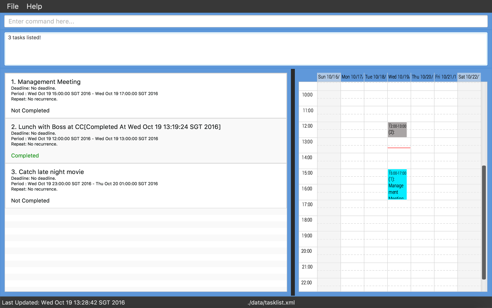

# TaSc

 

* TaSc (pronounced '*tas*', without the '*k*'), is a desktop task list application. The name comes from the initials of **ta**sk **sc**heduler.
* It has a GUI but most of the user interactions happen using a CLI (Command Line Interface).
    * It provides a list of commands, suitable for keyboard users, in order to manage the tasks in the task list.
    * It provides a GUI interface (with list and browser) so as to get a visual feedback of the task list for easier management.
* It is written using the Java programming language.
* For developers, it has support for *Build Automation* using Gradle and for *Continuous Integration* using Travis CI.

#### Target Audience
Jim is a heavy keyboard user.

Jim chances upon TaSc, a program that allows him to manage his task list by typing commands,
instead of having to use the mouse.

Jim uses the GUI mainly to see the result of the commands that he executed, but does not click 
on the interface. The keyboard is his main tool.

Jim wants to be able to work offline, and be able to follow the [Inbox Zero](http://whatis.techtarget.com/definition/inbox-zero)
workflow.
  
#### Site Map
* [User Guide](docs/UserGuide.md) 
* [Developer Guide](docs/DeveloperGuide.md) 
* [Learning Outcomes](docs/LearningOutcomes.md) 
* [About Us](docs/AboutUs.md)
* [Contact Us](docs/ContactUs.md)

#### Acknowledgements
The W11-C4 team (#teamfour) would like to thank the following people for supporting them during the development of TaSc.

Many thanks to our supervisor, Mr Akshay Narayan, and our module lecturer, Professor Damith C. Rajapakse, for providing valuable feedback for improving our program features and interface, and guiding us through the development of the product in terms of workflow and design.

We would also like to thank our other TA, Mr Muthu Kumar Chandrasekaran for guiding some of our team members on basic software engineering principles through week 1 to 6 (before the commencement of the TaSc project in week 7).

Finally, we would like to thank the development team of [AddressBook-Level4](https://github.com/se-edu/addressbook-level4) for providing a solid foundational codebase for teams like ours to build on top of and develop into our own product. This has allowed us to focus mostly on developing the task management features in our product instead of having to start entirely from scratch, and has saved us a great amount of work.

#### Licence : [MIT](LICENSE)
