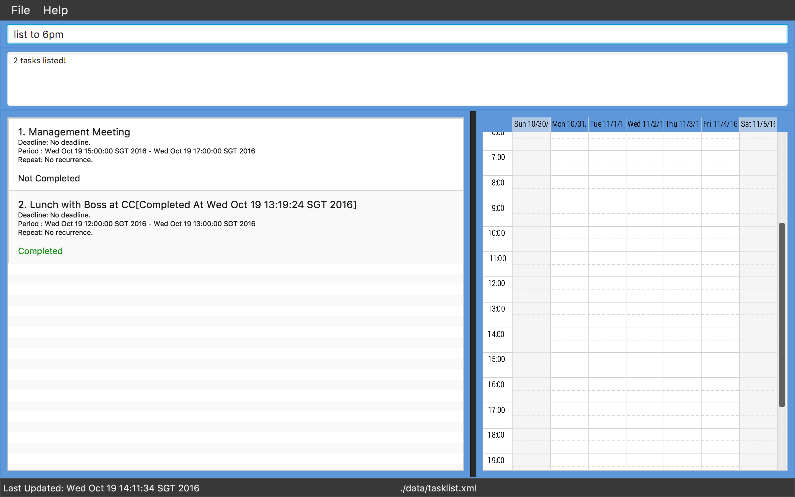
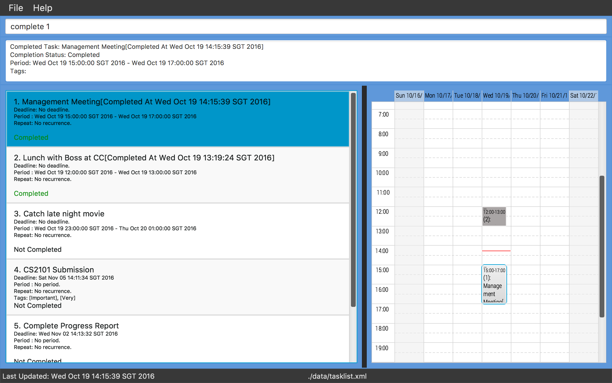

# User Guide

## Table of Contents

* [Introduction](#introduction)
* [Quick Start](#quick-start)
    * [Installing](#installing)
    * [Launching](#launching)
    * [Using the Interface](#using-the-interface)
* [Features](#features)
    * [Adding a new task/event: `add`](#adding-a-new-taskevent-add)
    * [Selecting a task to view its details: `select`](#selecting-a-task-to-view-its-details-select)
    * [Listing all tasks/events with specified conditions: `list`](#listing-all-tasksevents-with-specified-conditions-list)
    * [Narrowing listing results with specified type, date or tags: `show`](#narrowing-listing-results-with-specified-type-date-or-tags-show)
    * [Hiding listing results with specified type, date or tags: `hide`](#hiding-listing-results-with-specified-type-date-or-tags-hide)
    * [Finding tasks/events which match keywords: `find`](#finding-tasksevents-which-match-keywords-find)
    * [Changing the details of a task/event: `update`](#changing-the-details-of-a-taskevent-update)
    * [Marking a task as complete: `complete`](#marking-a-task-as-complete-complete)
    * [Undoing the last action: `undo`](#undoing-the-last-action-undo)
    * [Redoing the last action: `redo`](#redoing-the-last-action-redo)
    * [Deleting a task/event: `delete`](#deleting-a-taskevent-delete)
    * [Clearing all data: `clear`](#clearing-all-data-clear)
    * [Switching to a different task list: `switchlist`](#switching-to-a-different-task-list-switchlist)
    * [Renaming the task list file: `renamelist`](#renaming-the-task-list-file-renamelist)
    * [Relocating the data storage location: `relocate`](#relocating-the-data-storage-location-relocate)
    * [Changing the view of the task list panel: `collapse` and `expand`](#changing-the-view-of-the-task-list-panel-collapse-and-expand)
    * [Changing calendar view: `calendar`](#changing-calendar-view-calendar)
    * [Viewing help: `help`](#viewing-help-help)
* [Other Features](#other-features)
    * [Autocomplete and suggestions](#autocomplete-and-suggestions)
    * [Saving the Data](#saving-the-data)
* [FAQ](#faq)
* [Commands Cheat Sheet](#commands-cheat-sheet)
  

<!-- @@author A0127014W -->
## Introduction

Organize your tasks with just a *single* line of command.

Need to add, delete or update a task? *One line* is all that it needs. 
Want to list, search or filter your tasks? *One line* is all that it takes.

Many of us lead busy lives, with never ending streams of tasks often weighing on our minds. We understand it all too well, and we want to lessen that burden for you.

This is the motivation behind TaSc, our Task Scheduler with keyboard usability at its core. TaSc is quick, simple, and contains all the functionalities you need to plan and record your tasks.

Just type in your command, and hit <kbd>Enter</kbd>. Let us handle the rest - you have more important things to do.
  
<!-- @@author -->

## Quick Start

### Installing
1. Ensure that you have Java version `1.8.0_60` or later installed on your computer. 
> **Note:** 
> Having any Java 8 version is not enough.  
> This app will not work with earlier versions of Java 8.

2. Download the latest `TaSc.jar` from the [releases](../../../releases) tab (on our GitHub project website) as shown in *Figure 1* below.

    
   *Figure 1: Download TaSc.jar from GitHub*

3. Copy `TaSc.jar` to the folder you would like to use as the home folder for your TaSc application.
  

### Launching

Double-click on `TaSc.jar` to start the application. The application window (as shown in *Figure 2*) should appear within a few seconds.

 
*Figure 2: TaSc application window*
  

### Using the Interface

Type your command in the command box and press <kbd>Enter</kbd> to execute it. 

You can try some of these example commands:
   * **`add`**` "Do Research" by 21 Sep 5pm` :
	adds a new task named "Do Research" with the deadline on 21 September, 5pm
   * **`list`** : lists all uncompleted tasks and upcoming events
   * **`complete`**` 1` : marks the first task shown in the current task list as complete
   * **`exit`** : exits the application

 

<!-- @@author A0127014W -->
## Features

### Adding a new task/event: `add`

You can easily add a new task by giving it a name using the `add` command:

`add "A new task"`

> **Tip:** 
> Commands are not case-sensitive.

 
If your task is due on a certain date, you may provide a deadline by adding the `by` keyword:

`add "CS2101 homework" by 21 Oct 5pm`

> **Tip:** 
> Accepted date formats: 18 Sep, 18 September, 18 Sep 2016, Sep 18 2016,
  Today, Monday 
> Accepted time formats: 5pm, 5:01pm, 5:01:59pm, 17:00

 
Events can also be added easily by providing the period that it will happen
with the `from` and `to` keywords:

`add "CS2101 Meeting" from 24 Oct 3pm to 5pm`

 
Some events happen repeatly (for example, lectures are conducted every week).
You can specify a recurring task/event by using the `repeat` keywords:

`add "GET1006 Lecture" from Monday 8am to 10am repeat weekly 18`

> **Note:**  
> `repeat weekly 18` means that the lecture will take place for 18 weeks. 
> Accepted recurrence patterns: daily, weekly, monthly

 

Finally, you can add tags to categorize your tasks. For example,
you may use tag "Very Important" to prioritize certain tasks (as shown in *Figure 3* below).

`add CS2101 Submission by 5 Nov tag "Very Important" tag "CS2101"`

 
*Figure 3: The `add` command allows you to add a new task easily*
  

In general, you may use this format to add tasks with various parameters. 
`add NAME [by DEADLINE] [from START_TIME to END_TIME] [repeat PATTERN FREQUENCY] [tag TAG...]`

 * Words in lower case are the keywords for specifying what details you want to input for the task  (e.g. use `by` to set deadline for task)
 * Words in UPPER CASE are the values associated with the keyword. Replace the placeholder (in capital letters) with the correct value that you want to set. (e.g. replace `DEADLINE` with `1 April` to set task deadline as 1 April)
 * Keywords and values surrounded by `[` and `]` are optional. (e.g. both `add project` and `add project by tomorrow` are valid commands, as the deadline is optional)
 * Keywords followed by `"..."` can appear multiple times in one command. (e.g. `add project tag important tag work` will add a task with two tags, `important` and `work`) 

 

<!-- @@author A0148096W -->
### Selecting a task to view its details: `select`

Now that you have added your tasks, you can select the first task on the list by typing:

`select 1`

The task will be shown and highlighted on the task list and calendar, where you can see all its details such as its time period.
  

The task list will also automatically scroll to the task details on the task list. 
For example, if you have many tasks and you would like to see the fourteenth task which is not shown in the task list, just type:

`select 14`

Additionally, if you would like to see the last task in the task list, you can type:

`select last`
  

In general, you may use this format to select specific tasks on the task list. 
`select INDEX` *or* `select last`

 

### Listing all tasks/events with specified conditions: `list`

You may have a lot of tasks in your task list after using TaSc for a
certain amount of time. The `list` command allows you to filter your tasks in the list.

First of all, if you just want to see a list of uncompleted tasks and upcoming
events, just type:

`list`

> **Note:** 
> For your convenience, this command automatically sorts the task list by date `earliest first`.

 
You may want to view tasks that happen during certain periods:

`list from 18 Sep 1pm to 6pm`

 
You may also want to view tasks that need to be done by a certain time
and require your attention:

`list by 20 Sep`

 
You may also list category of tasks by their tags:

`list tag "Submissions"`

 
What about tasks with no deadlines and periods? They are known as
*floating* tasks, and you can list them using:

`list floating tasks`

> **Tip:** 
> The available types are:
> `all`, `uncompleted`, `completed`, `period`, `deadline`, `overdue`, `floating`, `recurring`, `events`, `tasks`, and `free time`.
 

You can use a combination of the types:

`list floating tasks completed`

 
Finally, if you need to sort your tasks, enter the following:

`list sort earliest first`

> **Tip:** 
> Sorting order includes `earliest first`, `latest first` for date and time,
  and `a-z`, `z-a` for task descriptions.

 

 
*Figure 4a: Filter your tasks by period end time.*
  

 
*Figure 4b: The `list` command allows you to filter your tasks easily.*
  

In general, you may use this format to list tasks with various filters. 
`list [TYPE...] [by DEADLINE] [from START_TIME] [to END_TIME] [tag TAG...] [sort SORTING_ORDER]`

 

### Narrowing listing results with specified type, date or tags: `show`

Already typed your list command, only to find out that you have more filters
to add? Don't retype your `list` command, simply use the `show` command
to further narrow your task list results.

For example, you may want to list out the uncompleted tasks, so you typed this:

`list uncompleted tasks`

However, you realise that only want to see those for your module CS2103. Instead of typing
the entire `list` command again (`list uncompleted tasks tag "CS2103"`),
enter this instead:

`show tag "CS2103"`

> **Tip:** 
> Because this is an extension of the `list` command, any parameter that is
> accepted by the `list` command is also accepted by the `show` command.
  

In general, you may use this format to show various tasks from the tasks listed. 
`show [TYPE...] [on DATE] [by DEADLINE] [from START_TIME] [to END_TIME] [tag TAG...]`

 

### Hiding listing results with specified type, date or tags: `hide`

Similar to `show`, you may want to `hide` some tasks instead.

To list every uncompleted tasks **except** for those tagged as "CS2103", enter these:

`list uncompleted tasks` 
`hide tag "CS2103"`
 

In general, you may use this format to hide various tasks from the tasks listed. 
`hide [TYPE...] [on DATE] [by DEADLINE] [from START_TIME] [to END_TIME] [tag TAG...]`

 

<!-- @@author A0127014W -->
### Finding tasks/events which match keywords: `find`

You don't have to remember every details of the tasks you added, just use the `find`
command which returns the list of tasks which partially match by their names or tags.

To show tasks with names such as "Up**grad**e myself", or with tags such as
"**Grad**ed":

`find grad` 

In general, you may use this format to find tasks using keywords. 
`find KEYWORD...`

 

<!-- @@author A0140011L -->
### Changing the details of a task/event: `update`

You have a list of tasks, and you realised that there is a typo in the name of the first task. You can correct the typo by typing:

`update 1 name "New Task Name"`

> **Note:** 
> The number used is relative to the position of the task in the list.

 
What if the deadline is wrong? You can change the deadline to 20 Sep by entering this:

`update 3 by 20 Sep`

Any other details of the tasks that you have added can be updated easily (see
the `add` command section to see the details that tasks can have).

 
Or you can add more tags to the task:

`update 4 tag "Low Priority"`

Or if the deadline is no longer valid, remove it by adding `remove` before the keyword `by`:

`update 5 removeby`

> **Tip:** 
> This works for any other keywords you may have used in your `add` command,
> like `removefrom`, `removeto`, `removerepeat`, `removetag` etc.
  

In general, you may use this format to update your tasks' various parameters. 
`update INDEX [name NAME] [by DEADLINE] [from START_TIME to END_TIME] [repeat PATTERN FREQUENCY] [tag TAG...]`
 * INDEX refers to the task's index number as shown in the task list.

 

### Marking a task as complete: `complete`

Once you have completed a task, you can mark it as complete (see *Figure 5*).

`complete 1`

 
*Figure 5: Marking a task as complete*
  
In general, you may use this format to mark your tasks as complete. 
`complete INDEX`

 

<!-- @@author A0148096W -->
###  Undoing the last action: `undo`

Mistakes in TaSc have very little consequence. You can easily undo any previous action which
modified the task list (for example, deleting a task):

`undo`

 
You can undo the last *X* actions. For example, to undo the
last 5 actions taken:

`undo 5`

> **Note:** 
> Sorry! To help you save memory on your computer, 
> you can only undo up to the 10 most recent tasks.
  

In general, you may use this format to undo various number of changes. 
`undo [LAST STEPS]`
 * LAST STEPS refer to the number of steps to undo, starting from the latest step. 

If you simply type:
`undo`
, the last step will be undone.

 

<!-- @@author A0147971U -->
###  Redoing the last action: `redo`

If the undo is not what you wanted, you can simply reverse them by using the redo command. 
Only tasks that are undone right before you type redo (with no other commands entered) can be actually redone.

`redo`

 
You can redo the last *X* actions. For example, to redo the
last 4 actions taken:

`redo 4`
  

In general, you may use this format to redo various number of changes. 
`redo [LAST STEPS]`
 * LAST STEPS refer to the number of steps to redo, starting from the latest step. 

If you simply type:
`redo`
, the last step undone will be redone.

 

<!-- @@author A0127014W -->
### Deleting a task/event: `delete`

Sometimes, instead of marking it as `complete`, you may want to clean up
your task list to save disk space on your computer.

`delete 3`

> **Caution:** 
> Deleted tasks cannot be recovered **after** you exit the application. If you
> wish to keep the details of the task, use `complete` instead.
  

In general, you may use this format to delete your tasks. 
`delete INDEX`

 

### Clearing all data: `clear`

Same as `delete`, but deletes the entire list.

`clear`

> **Caution:** 
> Deleted tasks cannot be recovered **after** you exit the application. If you
> wish to keep the details of the task, use `complete` instead.

 

<!-- @@author A0147971U -->
### Switching to a different task list: `switchlist`

You should keep different schedules on separate lists (for example,
one list `work.xml` for your tasks in your daily job, and another list `life.xml`
for your activities outside your work).

To do so, simply type the switch list command:

`switchlist life`

> **Tip:** 
> If the file does not exist, TaSc will assume that you want to create a new
> task list, and will create an empty file for you automatically.
  

In general, you may use this format to switch to different lists. 
`switchlist FILENAME`

 

### Renaming the task list file: `renamelist`

You may wish to rename your task list. For example, if your list is
currently named `life.xml` and you would like to rename it to `family.xml`, enter:

`renamelist family`

In general, you may use this format to rename lists. 
`renamelist FILENAME`

 

### Relocating the data storage location: `relocate`

For convenience, you may want to move the entire folder, where all your task lists
are stored, to another location. For example, you want to move your task list into
your Dropbox folder so that you can access it on another computer. Presuming your Dropbox
folder is at `/dropbox/`, you may do so by typing:

`relocate dropbox/tasklist`

> **Tip:** 
> enter `relocate` without designated path and the app will relocate the
> file to the original path.
  

In general, you may use this format to relocate your data to different location. 
`relocate PATH`

 

<!-- @@author A0127014W -->
### Changing the view of the task list panel: `collapse` and `expand`

When TaSc starts, your tasks are shown in the "collapsed" view. This means that TaSc will only show the index number and the name
of each task. This allows each task to take up less space in the task list panel, and allows more tasks to be shown simultaneously. But sometimes you might want to see all the details of all your tasks shown at once. In this case, you can expand the task list panel view
by typing:

`expand`

This will change the view from something like this (*Figure 6a*):  
 
*Figure 6a: The collapsed view*
  

To this (*Figure 6b*): 
 
*Figure 6b: The expanded view*

If you want to collapse the view of your tasks again, type:

`collapse`

 

<!-- @@author A0148096W -->
### Changing calendar view: `calendar`

Sometimes, you may want to focus on a day on the calendar. 
Just switch to the calendar day view (*pictured on the left in Figure 7*) by typing: 

`calendar day`

 
*Figure 7: Examples of calendar day and week view*

 
You can switch back to the calendar week view by typing:

`calendar week`

 
At any time, you can show your current time on the calendar to see your upcoming schedules, using:

`calendar today`

 

<!-- @@author -->
### Viewing help: `help`

There are so many commands in TaSc, but you don't have to memorise them.
Just open this document anytime again by typing the `help` command:

`help`

  

## Other Features

<!-- @@author A0147971U -->
### Autocomplete and suggestions
Shows suggested command keywords, dates, sorting order, and tags as you type.

Use the <kbd>up</kbd> and <kbd>down</kbd> arrow keys to select a keyword in the list, 
and the <kbd>tab</kbd> key to autocomplete with the highlighted keyword (*see Figure 8*).

 
*Figure 8: The autocomplete feature shows you the list of valid keywords for the command.*
  

<!-- @@author -->
### Saving the Data
TaSc saves your data automatically after every command that changes the data.
Don't worry about losing your data.

### Moving to Another Computer
If you want to move your task lists to a new computer, backup the contents of your current TaSc
folder. Install and run `TaSc.jar` on the other computer, and a new data file will be created.
Overwrite the new data file with the backup you made.

 

## Commands Cheat Sheet

> Parameters in `[ ]` are optional. 

Command | Format  
-------- | :--------
Add | `add NAME [by DEADLINE] [from START_TIME to END_TIME] [repeat PATTERN FREQUENCY] [tag TAG...]`
Select | `select INDEX` *or* `select last`
List | `list [TYPE...] [by DEADLINE] [from START_TIME] [to END_TIME] [tag TAG...] [sort SORTING_ORDER]`
Show | `show [TYPE...] [on DATE] [by DEADLINE] [from START_TIME] [to END_TIME]  [tag TAG...]`
Hide | `hide [TYPE...] [on DATE] [by DEADLINE] [from START_TIME] [to END_TIME] [tag TAG...]`
Find | `find KEYWORD...`
Update | `update INDEX [name NAME] [by DEADLINE] [from START_TIME to END_TIME] [repeat PATTERN FREQUENCY] [tag TAG...]`
Complete | `complete INDEX`
Delete | `delete INDEX`
Undo | `undo [last STEPS]`
Redo | `redo [last STEPS]`
Clear | `clear`
Switch List | `switchlist FILENAME`
Rename List | `renamelist FILENAME`
Relocate | `relocate PATH`
Collapse | `collapse`
Expand | `expand`
Calendar | `calendar day` *or* `calendar week` *or* `calendar today`
Help | `help`
